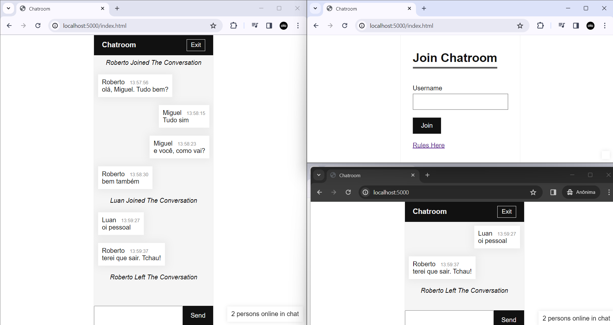

# 👋 welcome to the private chat room

## 📚 About the project
<p style="font-size: 15px">I developed this chat room where you can interact with different people who are connected.
You can see everyone who is online, in addition to sending messages you can see the exact time the message was sent.
The chat room contains some rules, which before "logging in" you can see them</p>


#

# Installation
###
## Running Locally
<p>Make sure you have Node.js and npm installed.</p>

- Clone or Download the repository
```
  $ git clone https://github.com/devmgdp/chatroom-sockets.git
  $ cd chatroom-sockets
```

- Install Dependencies
```
$ npm install
```

- Start the application
```
$ node server.js
```

<p>Your app should now be running on localhost:5000</p>


## 💻 Used Programming Languages

###

<div align="left">
  
  
  
  
  
  
  
  
  
</div>
